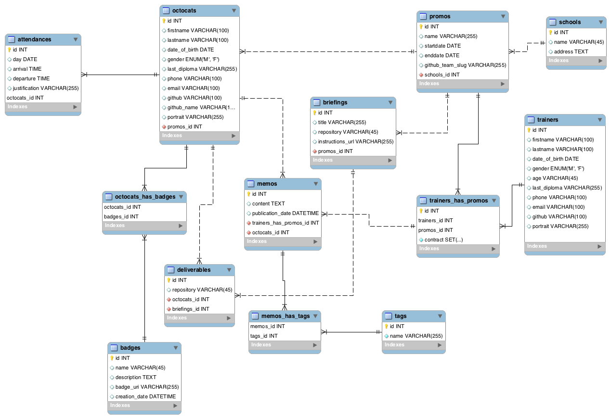
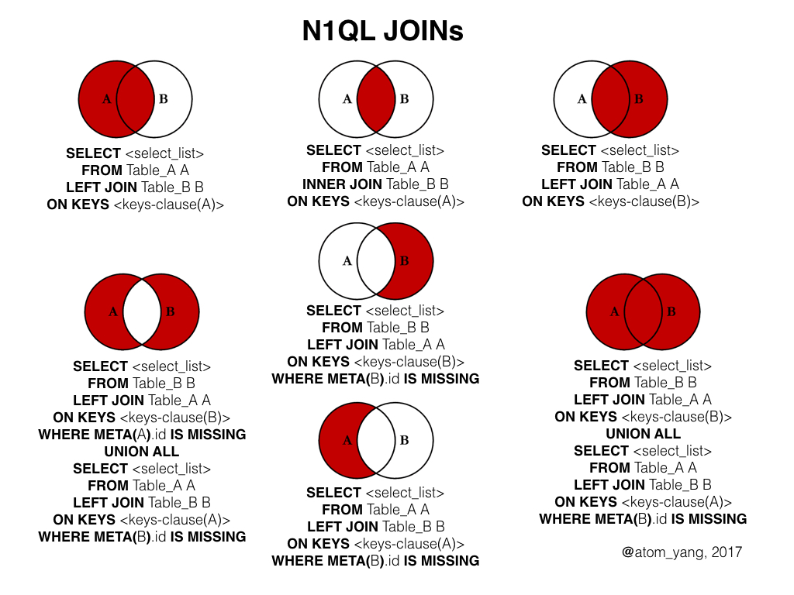

# Base de données relationnelles

(En anglais: *Relational databases*)

Voici le contenu d'une base de données, contenant des tables relationnelles. Autrement dit, des tables ayant des "relations" entre elles.
 ([en grand](https://dl.dropboxusercontent.com/u/150457/exemple-db-model.png))

## C'est quoi une relation?
C'est un peu comme dans les vestiaires d'une école. Pour que chaque enfant puisse retrouver sa veste, **on met une étiquette avec son nom sur la veste.**

Ainsi, si on veut savoir à qui appartient la veste, on lit le contenu de l'étiquette.

C'est le même principe dans les bases de données relationnelles. **Sauf que l'étiquette, en l'occurence, sera un numéro d'identifiant unique** (il n'y a pas 2x le même dans une même table). Examine le schéma ci-dessus: quels sont les champs qui servent d'étiquette ?

## à quoi ça sert?
Imagine que tu doives créer une nouvelle application, dont le client serait... Becode.  
Elle répondrait au besoin de gérer les inscriptions et la répartition des inscrits dans les classes de Becode.  Donc répondre à la question: *quel étudiant(e) va dans quelle classe*.

Pour cela, l'application afficherait une liste des étudiants par classe, avec leur prénom et leur nom.

Comme chaque année, il y aura de nouvelles classes et de nouveaux étudiants, on va concevoir une base de données pour gérer ces informations.

Pour être fonctionnelle, de quelles tables a besoin ton application? 

### prend 5 minutes avec papier et crayon
Pour le savoir, à deux, prenez une feuille de papier et listez chaque information nécessaire pour réaliser l'objectif: *"afficher une liste d'étudiants par classe, avec leur prénom et leur nom"*.  

Organise cette liste en regroupant ce qui va ensemble:

- qu'est-ce qui décrit une classe?
- Qu'est-ce qui décrit un étudiant?  

Tu as suffisamment d'information pour concevoir tes tables sql, sauf...

### Comment faire pour stocker dans tes tables à quelle classe appartient chaque étudiant?

Voici la table stockant les "classes":

**Table: Classes**

| Classe   |
|------------|
|  BXCentral  |
|  Anderlecht |

Avec cet identifiant unique (appelé `ID`), la table devient:

| ID |  Classe   |
|----|------------|
|  1 | BXCentral  |
|  2 | Anderlecht |

Ainsi, si dans une autre table je veux faire référence à la classe "BXCentral", je pointe vers son ID: "1".

Donc, je pourrais stocker l'information permettant d'enregistrer à quelle classe appartient l'étudiant" dans la table "students" en ajoutant une colonne à cette fin, dans laquelle mon application stocke le numéro de l' ID de la classe concernée:

| ID | Name | classe_id |
|----|---------|-----------|
|  1 | Habib   |         1 |
|  2 | Daniela |         1 |
|  3 | Claudy  |         2 |
|  4 | Adrian  |         2 |

Remarque comment, pour me faciliter la *life*, je nomme la colonne en utilisant le nom de la table associée? ("table" + "_" + "clef primaire" = classe_id. En vérité, tu nommes ta colonne comme tu veux, mais c'est toujours payant de choisir systématiquement des noms simples et explicites).

Peux-tu, sur base de `classe_id`, retrouver la classe à laquelle appartient chaque étudiant(e) ?

En SQL, l'opération consiste à faire **une jointure** (remarque le mot-clef `JOIN` suivi de la table à joindre à la première, suivi de `ON` suivi d'une équivalence spécifiant quel colonne de la table A doit matcher quelle colonne de la table B):

```sql
SELECT * FROM students 
LEFT JOIN classes ON classes.id=students.classe_id;
```

Ce principe de relation demande un peu d'habitude mais est extrêmement puissant. Il permet de créer des bases de données pour tout ce qu'il est possible d'imaginer de manière rationnelle.

## Les relations

### Relation 1-to-many (ou relation 1:N)
La relation qui relie classes et étudiants dans l'exemple précédent est une relation  "1-to-many":  chaque classe peut avoir plusieurs étudiants, mais chaque étudiant ne peut avoir qu'une seule classe.

Autres exemples d'entités dont la relation est 1-to-many :

- écrivain / livres : "un écrivain a plusieurs livres / un livre n'a qu'un seul écrivain".
- équipe de football / joueur: "une équipe de football a plusieurs joueurs / un jour n'a qu'une équipe de football".
- être humain / ville de naissance: "un être humain a une ville de naissance / une ville a plus d'un humain".

### Relation many-to-many (ou relation N:N)
Dans une relation "many-to-many", chaque rangée de la table A peut avoir une ou plusieurs relations avec des rangées de la table B. 
On a dès lors besoin d'une table spécifique stockant les relations.

Par exemple, une équipe de vendeurs doit vendre différents produits. On doit pouvoir CRUD les vendeurs, les produits et les ventes. Une vente correspond en fait à stocker l'information comme quoi un vendeur UNTEL a vendu un produit UNTEL.

**table: Sellers**

| id | Seller Name |
|----|---------|
|  1 | jacques |
|  2 | Thomas  |
|  3 | John    |

**table: Products**

| id | Product Name |
|----|---------|
|  1 | Pommes  |
|  2 | Poires  |
|  3 | Bananes |

**table: purchases**

| product_id | seller_id |
|------------|-----------|
|          3 |         1 |
|          3 |         1 |
|          1 |         2 |

Cette table est appelée une **table de jonction**.
(Voir la [doc](http://www.databaseprimer.com/pages/relationship_xtox/))

Pour avoir le détail des ventes en SQL, on utilise la syntaxe `JOIN`:

```sql
SELECT * FROM purchases 
LEFT JOIN products ON purchases.product_id=products.id 
LEFT JOIN sellers ON sellers.id=purchases.seller_id ;
```


### Relation 1-to-1 (ou relation 1:1)
Très peu utilisé, en général il vaut mieux les fusionner en une seule table.


([doc](http://www.databaseprimer.com/pages/relationship_1to1/)).

## Exercices dans un outil de modélisation

Allez, un peu de drill, tu verras que c'est plus facile que cela n'en a l'air.

Avant toute chose, installe [un outil visuel de modéllisation de bases de données](https://github.com/becodeorg/BeCode/wiki/Outils-de-mod%C3%A9lisation-de-base-de-donn%C3%A9es-(SQL)).

À l'aide de ce logiciel, réalise le schéma de la base de données pour chacune de ces différentes applications.
À chaque fois, indique les types de relation à mettre en place dans la DB: 
	
	1-to-1
	1-to-many
	many-to-many

- gérer **une collection de timbres**: on doit pouvoir CRUD les timbres et les collections
- gérer **un catalogue de livres, par auteur**: on doit pouvoir CRUD les auteurs et les livres
- gérer **une collection de recettes de cuisines**: on doit pouvoir CRUD les recettes et les ingrédients
- gérer **les horaires des enfants d'une école, regroupés en classes**. On doit pouvoir CRUD les enfants, les classes, et les cours
- gérer **un outil de blog**: on doit pouvoir CRUD les articles, les catégories, les mots-clef. Les catégories peuvent être hiérarchiques.
- gérer **un catalogue de vins**: on doit pouvoir CRUD:
	- pays
	- Exploitant-vigneron
	- vins
	- crus (année + type de raisin)
- gérer **des parties de poker**: on doit pouvoir CRUD les joueurs, les parties jouées, les championnats.

Te voilà arrivé(e) à la fin de ce parcours sur les bases de données relationnelles. Te voilà BOSS, car tu peux faire des trucs de ouf avec: *the sky is the limit!* 

 


## A lire

- [Relational Databases for Dummies](https://code.tutsplus.com/tutorials/relational-databases-for-dummies--net-30244)

## LEFT JOIN, RIGHT JOIN, INNER JOIN. UNION
Tout pigé ? sache que tu peux faire plus que de "simple" "LEFT JOIN" 


