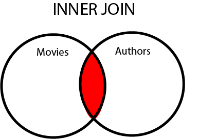
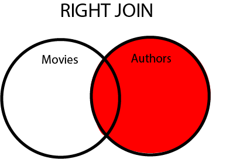

# LEFT JOIN, RIGHT JOIN, INNER JOIN. 

Maintenant que tu sais ce qu'est une jointure, allons un peu plus loin. 
Nous allons simuler ce que serait (en beaucoup plus simplifié) la base de données d'un site  comme [imdb.com](http://www.imdb.com/)

### Création de la base données. 

Tout d'abord, créé une base de données dans PHPMYADMIN qui aura comme nom ````imbd````.

Ensuite, importe le fichier [imdb.sql](./assets/imdb.sql) dans ta base de données. Tu devrais avoir deux tables, une se nommant ```authors``` et une autre se nommant ````movies```` 

### Quelle est la différence entre INNER JOIN, LEFT JOIN ET RIGHT JOIN ?
#### INNER JOIN ou JOIN
Si tu observes bien la base données, dans la table ``authors`` tu verras qu'il y a une rangé avec "Tintin en Amérique" et un auteur qui à l'id_authors à 59. Or il n'y a pas d'auteur avec l'id 59. Que se passe t'il si tu selectionnes ***TOUTES*** les entrées de la table ````movies```` en y joignant l'auteur ?

Copie cette requête dans phpmyadmin et vois le résultat.

````sql
SELECT * FROM movies INNER JOIN authors ON movies.id_author = authors.id
````

Comme tu peux le voir, il ne renvoie pas *Tintin en Amérique* qui se trouve  pourtant bien dans la base de données. En fait INNER JOIN ne renverra seulement que les valeurs communes entre la table ```authors``` et la table ```movies```. Comme "Tintin en Amérique" n'a aucune correspondance avec la table ````authors````, il n'est pas retourné comme résultat. 



Si tu mets un simple ``JOIN`` ça revient à faire un  ``INNER JOIN``. 

#### LEFT JOIN 

Si tu souhaites quand même que toutes les valeurs de la table ```movies```soient affichées, et y compris celle qui n'ont pas de relation avec la table auteur, tu dois  utiliser le ``LEFT JOIN``

````sql
SELECT * FROM movies LEFT JOIN authors ON movies.id_author = authors.id
````

Comme tu  peux le constater, cette fois-ci *Tintin en Amérique* fait bien parti du résultat mais avec des valeurs ``NULL`` pour les champs authors.id, authors.lastname et authors.firstname.


#### RIGHT JOIN

Imaginons que maintenant tu souhaites avoir toutes les valeurs qui sont dans la table ``authors`` même si aucun film n'est associé à cet auteur. C'est ici qu'intervient le RIGHT JOIN.

````sql
SELECT * FROM movies RIGHT JOIN authors ON movies.id_author = authors.id
````
Cette requêtte renverra un résultat avec l'auteur *Yves Lavandier* qui n'a aucun film associé dans la table movies et aura donc comme valeur NULL pour tous les champs se référant à la table ``movies``




## DRILL

Dans un fichier php, affiche à l'aide d'un ```print_r()``` les résultats suivants. 

1. Affiche uniquement les films de "Cristopher Nolan" :
2. Avec l'aide de l'image ci-dessous, utilise un "LEFT JOIN" et affiche **TOUTES** les valeurs de la table ``authors``.
3. Affiche **TOUTES** les valeurs qui se trouvent dans la table ``authors`` et ``movies``
3. Affiche **uniquement** les valeurs qui n'ont pas de correspondances entres les tables. (Donc le résultat devrait être "Tintin en Amérique" et "Yves Lavandier".)
4. Affiche **uniquement** les valeurs qui n'ont pas de correspondances avec la table ``authors``.
5. Modifie dans la rangé "Tintin en Amérique" en "Tintin et le secret de la licorne" et modifie l'id de l'auteur avec celui de "Steven Spielberg". 


## NAV
1. [Intro](./readme.md)     
1. Read : [SELECT](./1.select.md)  
1. Create : [INSERT INTO](./2.insert.md)  
1. Update : [UPDATE](./3.update.md)   
1. Delete : [DELETE FROM](./4.delete.md)  
1. Pour [voler de tes propres ailes](./5.moveon.md)
1. PHP + MySQL  : [via PDO](./6.pdo.md)   
1. [Base de données relationnelles](./7.relational-db.md)
1. [INNER JOIN/ LFET JOIN /RIGHT JOIN](./8.join.md) ←  
